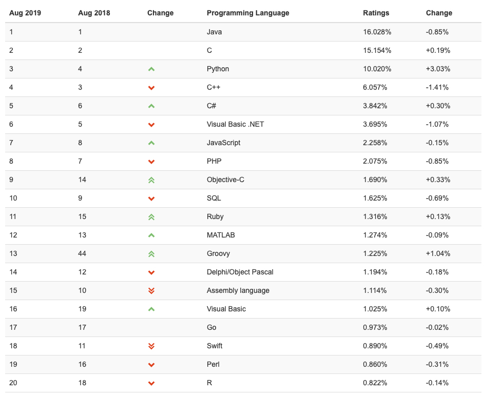
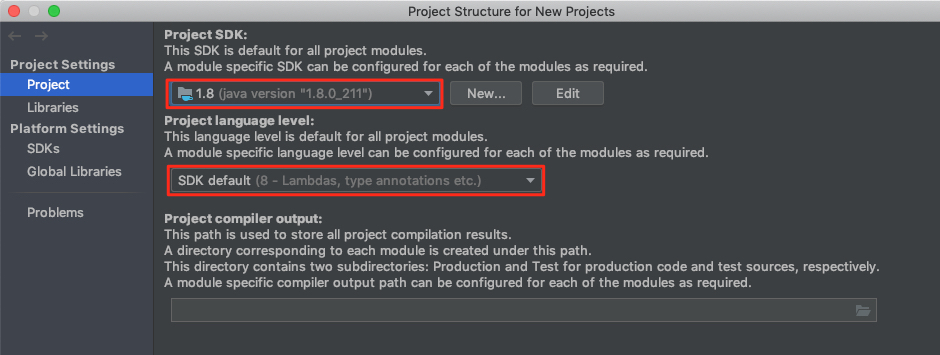
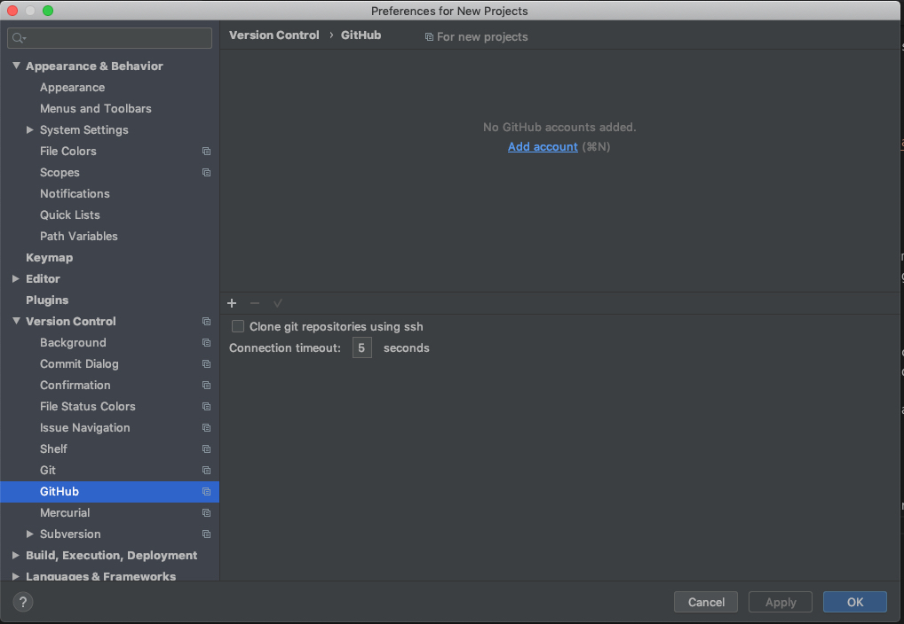
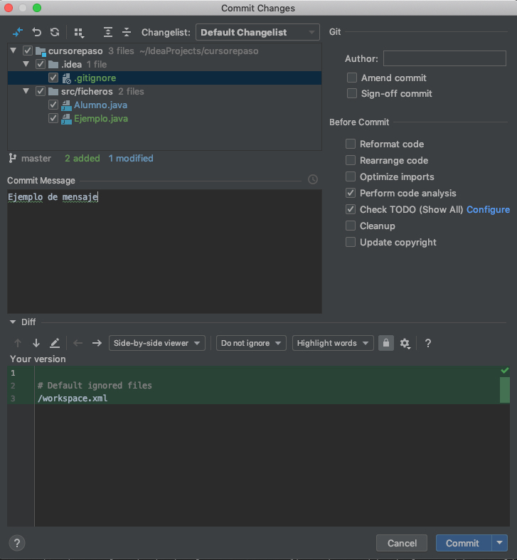
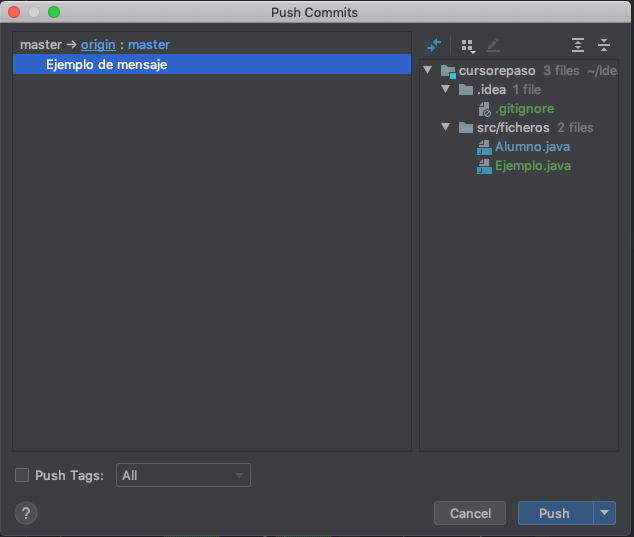

- [Introducción a la programación:](#tema1)
    - Datos, algoritmos y programas.
    - Paradigmas de programación.
    - Lenguajes de programación.
    - Herramientas y entornos para el desarrollo de programas.
    - Errores y calidad de los programas.

### Enlaces necesarios
***

- <a href="https://www.oracle.com/technetwork/java/javase/downloads/jdk11-downloads-5066655.html" target=»_blank> Java JDK</a>
- <a href="https://docs.oracle.com/en/java/javase/12/docs/api/index.html" target=»_blank> Java 12 API</a>
- <a href="https://netbeans.apache.org/download/index.html">NetBeans</a>
- <a href="https://www.jetbrains.com/idea/download/" target=»_blank> Intellij IDEA IDE</a>
- <a href="https://www.eclipse.org/downloads/" target=»_blank> Eclipse IDE</a>
- <a href="https://git-scm.com/downloads" target="blank">Git</a>
- <a href="https://github.com" target=»_blank>GitHub</a>
- <a href="https://desktop.github.com">GitHub Desktop</a>
- <a href="https://dev.mysql.com/downloads/connector/j/5.1.html" target=»_blank>JDBC Connector</a>

### Lenguajes de programación

Según diversos autores es un programa destinado a la construcción de otros programas informáticos. Su nombre se debe a que comprende un lenguaje formal que está diseñado para organizar algoritmos y procesos lógicos que serán luego llevados a cabo por un ordenador o sistema informático, permitiendo controlar así su comportamiento físico, lógico y su comunicación con el usuario humano. Existen numeros lenguajes de programación, muchos de ellos específicos para algunas tareas. No es necesario conocer todos los existentes ya que el manejo avanzado de uno permite cambiar entre lenguajes sin mucho trabajo, simplemente es necesario conocer la sintaxis del nuevo lenguaje. La mayoría de ellos se basan en un mismo concepto: programación orientada a objetos, por lo que es lo realmente importante de manejar. 

Una lista de los principales lenguajes de programación y su uso en mercado a Agosto de 19 (según el estudio Índice TIOBE)

Fuente: https://concepto.de/lenguaje-de-programacion/#ixzz5x7qcsJqZ

#### ¿Qué es un algoritmo?

Un algoritmo es una serie de instrucciones que son ejecutadas para poder solventar un problema. Según esta definición, un algoritmo podría ser cualquier tarea cotidiana a la que nos enfrentamos. Cuando estamos hablando de ordenadores, a los algoritmos hay que añadirle datos de entrada (inputs) y datos de salida (outputs) los cuales interfieren con el desarrollo del problema.

Cuando una persona se enfrenta a un problema cotidiano no piensa cuales son los pasos que tienenq ue dar para poder solucionarlo ya que la gran mayoría está automatizado. Si estamos hablando de un algorítmo informático, es necesario decirle paso a paso al ordenador cuales son las tareas que se deben llevar a cabo.

Ejemplos:

1. Define el algorimo para realizar una tarea cotidiana

### Instalar JDK y setear variable de entorno

Una vez descargado e instalado <a href="https://www.oracle.com/technetwork/java/javase/downloads/jdk11-downloads-5066655.html" target=»_blank> el Java JDK</a>, es interesante setear como variable de sistema la ruta donde se encuentran los ejecutables de java (javac, javadoc y java).

Para ellos, simplemente hay que agregar la ruta anterior en las variables del sistema desde la propiedades del sistema (en windows) o ejecutando una serie de comandos (mac y linux). 

Para poder comprobar que todo ha funcionado correctamente se puede ejecutar el siguiente comando:

javac o java -version

En caso de obtener todos los comandos que se pueden ejecutar la variable de entorno estará configurada correctamente.

### Instalar Intellij IDEA

<a href="https://www.jetbrains.com/idea/download" target=»_blank> Intellij IDEA IDE</a>
es un es un entorno de desarrollo integrado para el desarrollo de programas escritos en java - kotlin. Existen dos versiones, siendo una de ellas gratuita. La diferencia entre las dos es el soporte de JavaScript - TypeScript así como herramientas y/o framewoks que facilitan el trabajo a los programadores. Su instalación es muy sencilla ya que simplemente es descargar el instalador y ejecutarlo. 

Una vez descargado e instalado la configuración inicial para poder empezar a trabajar no necesita de grades cosas. Simplemente hay que asegurarse que se ha detectado el jdk de java. Para ello hay que entrar en project structure

Para ver todas las funcionalidades existe una <a href="https://www.jetbrains.com/help/idea/discover-intellij-idea.html" target="_blank">guía oficial</a> donde se pueden consultar

### Crear cuenta de github y manejo

GitHub es una plataforma de control de versiones mediante la cual se pueden compartir y mantener proyectos informáticos entre equipos de trabajo de forma muy sencilla. Existen dos modalidades: gratis y de pago. La diferencia básicamente es el acceso a los códigos o repositorios que se crean dentro de una cuenta. Mientras que la modalidad de pago puedes subir códigos que no serán vistos más que por los usuarios que se indique, la modalidad gratuita permite que los códigos sean vistos por toda la comunidad.

Para darse de <a href="https://github.com" target=»_blank>alta en GitHub</a> tan solo en necesario un correo electrónico e indicar un nombre de usuario y contraseña. Adicionalmente, para poder trabajar con la herramienta de control de versiones es necesario <a href="https://git-scm.com/downloads" target="blank">descargar el software git</a>, el cual permite la ejecición de los comandos necesarios para el manejo de los repositorios. Opcionalmente se puede descargar un cliente gráfico para el manejo de los comandos (se puede manejar simplemente con comandos en terminal) como por ejemplo el <a href="https://desktop.github.com">cliente oficial</a>

https://conociendogithub.readthedocs.io/en/latest/

Todo lo visto anteriormente se puede utilizar para trabajar mediante comandos o mediante la web (con la sesión iniciada), pero también se puede trabajar diréctamente desde el IDE seleccionado para programar (en nuestro caso Intellij IDEA). Para ello dentro de las preferencias hay que seleccionar en el árbol de la derecha la opción de "Control de versiones --> GitHub". Una vez ahí se añade una cuenta, la cual permitirá trabajar con repositorios propios o de otra persona (fork)

Con esa configuración hecha se podrá:
- Clonar un repositorio directamente desde la opción "Checkout from control version"
- Manejar un repositorio ya clonado desde el proyecto, confirmando y subiendo los cambios realizados:
    - Commit: acepta los cambios realizados en el repositorio local (se debe dejar un mensaje de información)
    
    - Push: sube al repositorio remoto los cambios aceptados desde un commit determinado (ambos pasos se pueden realizar en uno solo)
    
    
    - Pull: comprobación de posibles cambios en el repositorio remoto para descargarlos al local
    - Branch: ramas del proyecto que podrán ser creadas por cualquier persona que realice una petición. Estas deberán ser aprobadas por el creador del proyecto para que formen parte del mismo

